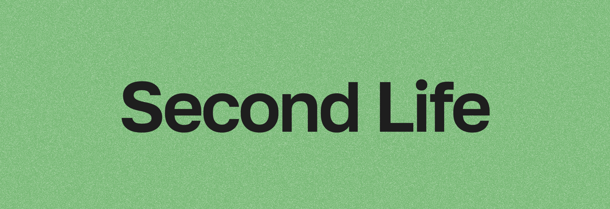
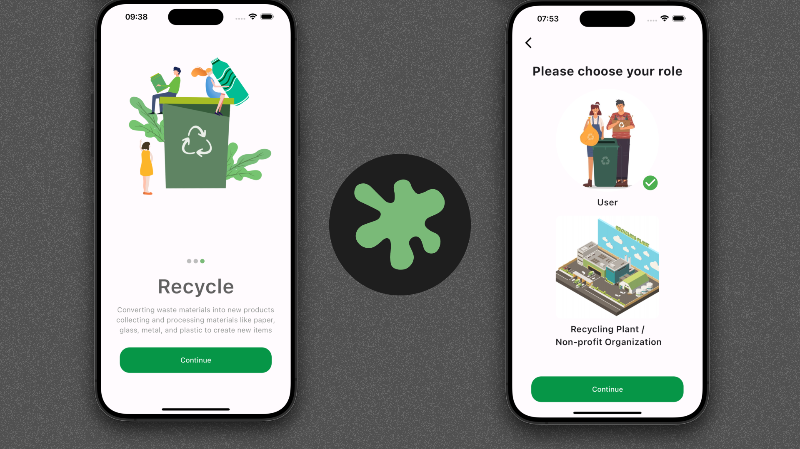
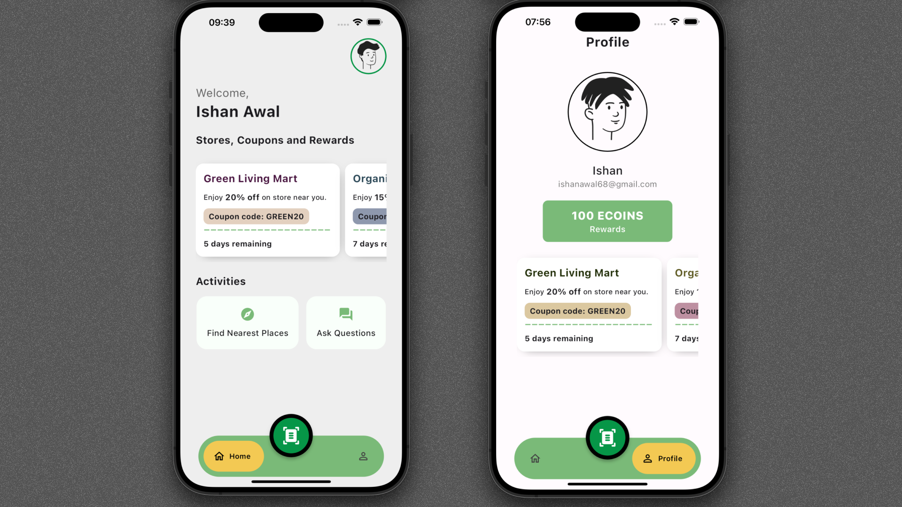
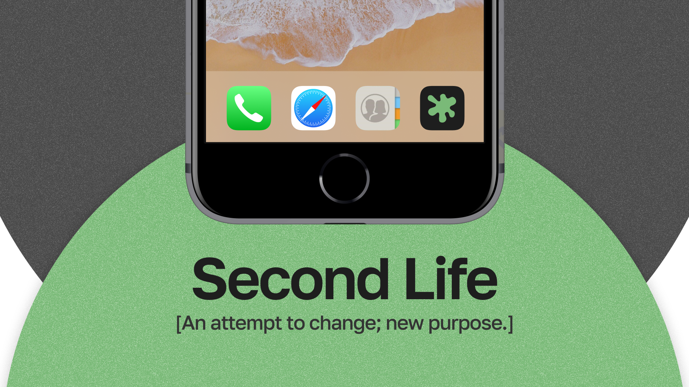
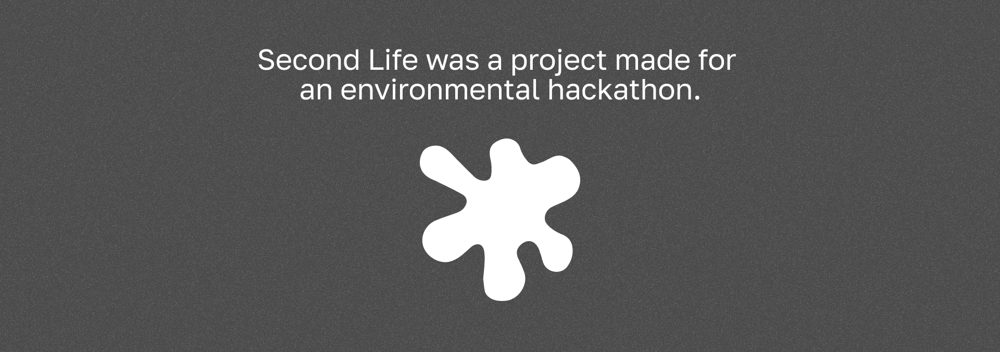

<a href="https://raft-in-motion.vercel.app">
  
</a>

## Intro...
Second Life is an approach to give waste—from clothes to plastics to food—a new purpose/life. We connect businesses and common people, using AI chatbots to educate and inspire smarter, more sustainable choices. A genuine step toward a circular future.

---

## Features so far 
- [x] Automatic APIs code gen for app layer using .proto & buf.
- [x] Postgres Models gen using JetORM.
- [x] User Authentication using JWT.
- [x] Runtime Layer to serve/consume APIs using ConnectRPC.
- [x] Typesafe APIs w/ test using bruno.
- [x] APIs exposure using chi routers.
- [x] pgSQL interaction using JetORM.
- [x] Object detection from image using YOLO & cv2.
- [x] Ollama LLM chatbot.
- [x] Reward Point System.
- [x] Instructions & video suggestions regarding recycling.
- [x] Nearby business/ Public services suggestion via location.
- [ ] Better LLM usage.
- [ ] Accurate object detection.
- [ ] oauth 2 usage.
- [ ] Realtime interactions between clients.

---

## Project Structure

- `api/` - API specifications and definitions
  - `bruno/` - API endpoint tests and configs using Bruno
  - `proto/` - protobuf defs for service interfaces
- `cmd/` - the main entry points for GO app
  - `gen/` - Code gen
  - `second-life/` - Main service app
- `gen/` - Auto-gen code from protobuf
  - `bowie/` - Gen Go code for the service models and interfaces
- `internal/` - Core service implementation
  - `data/` - Data access and repository implementations
  - `handler/` - Request handlers for the API endpoints
  - `transform/` - Data transformation logic
  - `validation/` - Input validation logic
- `object/` - Object detection using YOLO & cv2
- `ollama/` - LLM integration with Ollama
## Running the Project

```bash
# psql setup: create a .env file at root direc.
DSN=
sslmode=
DB_USER=
DB_PASSWORD=
DB_NAME=
DB_HOST=
DB_PORT=


# with docker.
docker build -t second-life .
docker run -p 8080:8080 second-life
```

## Screenshots






## License

This project is licensed under the MIT License. See the [LICENSE](LICENSE) file for details.

## Contributing

If you have any suggestions or improvements, please create an issue or a pull request. I'll try to respond to all issues and pull requests.
